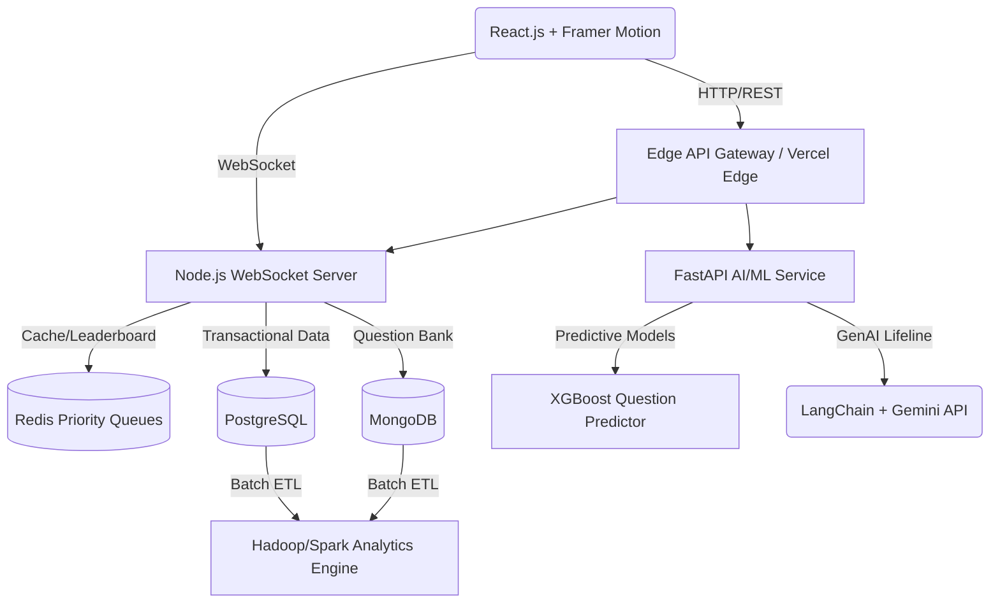

# Neural-KBC: Real-Time Distributed Gaming Engine 🚀


**Neural-KBC** is a production-ready, highly scalable quiz platform inspired by *Kaun Banega Crorepati* (Who Wants to Be a Millionaire), strictly architected with 2026-era advanced tech patterns. It blends a distributed microservices backend with real-time WebSocket communication, AI-driven gamification, and robust Big Data analytics.

---

## 🏗 System Architecture

Neural-KBC is designed primarily around a microservices architecture to ensure high availability, fault tolerance, and low-latency global edge deployments.



### Core Technologies
- **Frontend Layer**: ReactJS, TailwindCSS, Framer Motion (for dynamic transitions, money tree animations). Atomic Design pattern.
- **Real-Time Engine**: Node.js (Express), WebSockets, Redis (ZSETs for distributed leaderboards).
- **AI/ML Layer**: Python (FastAPI). Integrates Random Forest/XGBoost for question difficulty prediction and LangChain/Gemini for the "Expert Advice" generative AI lifeline.
- **Persistence Layer**:
  - `PostgreSQL`: Financials, Wallets, User state, Transactional Ledgers.
  - `MongoDB`: Dynamic JSON-schema Question Bank.
- **Big Data Analytics**: Hadoop & Apache Spark for asynchronous processing of player behavior logs.

---

## 🧠 Core Algorithms (DSA & AI Integration)

1. **Risk Assessment Engine (Dynamic Programming)**:
   - Evaluates the probability of a user answering a given question correctly based on their past category performance, available lifelines, and the current question's static ML predicted difficulty.
   - Maximizes the "Walk Away vs Play" Expected Value using value-iteration DP matrices.

2. **Hint Generation Engine (Backtracking)**:
   - For a given 4-option question, dynamically constructs logical reasoning paths to eliminate options. Uses backtracking to generate sequence trees that guide the player toward the answer without explicitly revealing it immediately.

3. **Global Leaderboards (Redis Sorted Sets)**:
   - `ZADD leaderboard <score> <player_id>`: Inserts and updates player scores in real-time.
   - `ZREVRANGE`: Fetches top N players globally in $O(\log N + M)$ time.

4. **Predictive Question Sourcing (XGBoost)**:
   - An ML pipeline that analyzes global success rates. Questions are dynamically mapped to a difficulty factor $D ∈ [0, 100]$ via regression to continuously calibrate the money tree scaling and adjust player specific difficulty based on Elo rating.

---

## 🛠 API Documentation (OpenAPI Overview)

The platform follows a strict REST paradigm combined with Pub/Sub through WS. Full Swagger documentation is automatically generated by FastAPI at `/api/docs`.

### REST Highlights (FastAPI / Node.js Core)
- **`GET /api/v1/auth/session`** - Instantiates a secure gameplay JWT session.
- **`POST /api/v1/game/lifeline/expert`** - Triggers the LLM agent via FastAPI.
  - *Payload*: `{ "question_id": "uuid", "user_context": {...} }`
  - *Response*: `{ "suggestion": "Based on historical precedents...", "confidence": 0.89 }`
- **`GET /api/v1/game/risk-profile`** - Computes DP matrix for current node. Returns risk-adjusted continuation vectors.

### WebSocket Highlights
- **`ws://api.neural-kbc.in/v1/playstream`**
  - **`publish:question_tick`**: Broadcasts server-side countdown timers to prevent client-side latency hacks.
  - **`publish:leaderboard_tick`**: Pushes global state ranking deltas powered by Redis Streams.

---

## 🚀 Setup & Execution Guide

### Prerequisites
- Node.js >= 20.x, Python >= 3.10
- PostgreSQL >= 16, MongoDB >= 7, Redis Stack
- Vercel CLI (for Edge local simulation)

### 1. Environment Configuration
Copy the sample environment manifest in each microservice:
```bash
cp .env.example .env
```
Ensure you provide your `GEMINI_API_KEY` in the FastAPI `.env`.

### 2. Bootstrapping Databases
```bash
npm run db:migrate    # Runs Prisma/Sequelize routines for PG
npm run db:seed       # Dumps base question bank to Mongo
```

### 3. Launching Microservices
**Node.js Core App Server:**
```bash
cd services/core-gateway
npm i && npm run dev
```

**FastAPI Machine Learning Module:**
```bash
cd services/ai-engine
python -m venv venv && source venv/bin/activate
pip install -r requirements.txt
uvicorn main:app --reload --port 8000
```

**React Client App:**
```bash
cd web-client
npm i && npm run dev
```

---

## 📈 Contribution & Git Flow

Adhere to our strict zero-space Git hygiene model:
- `chore/*` : Config, build scripts
- `feat/*` : New product elements
- `fix/*` : Bug resolution
- `ml/*` : Model tuning or pipeline integrations

Automated Prettier/ESLint hooks run pre-commit. **Merge via PRs only.**
